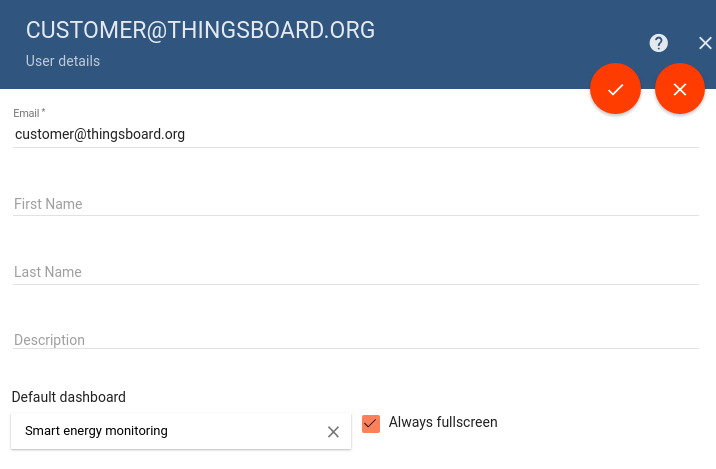
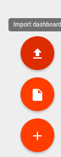
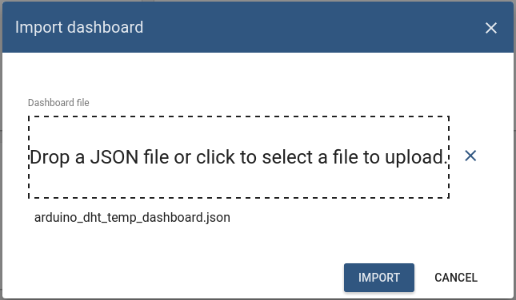
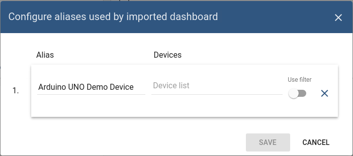

# dashboards

* TOC

  {:toc}

## Video tutorial

## Default IoT dashboard for customer user

Since ThingsBoard 1.2 you are now able to define default IoT dashboard for your customer users in 2 simple steps:

### Step 1. Assign IoT dashboard to customer

See embedded video tutorial above on tips how to do this.

### Step 2. Open customer user details

Navigate to "**Customers** -&gt; Your customer -&gt; **Customer Users**" and toggle edit mode using 'pencil' button in the top-right corner of the screen.

### Step 3. Select IoT dashboard

select the IoT dashboard from the list and apply changes. Please note that you can also check the "Always Fullscreen" mode to prevent a user from navigating to different dashboards/screens.

## IoT Dashboard import/export

### Dashboard export

You are able to export your dashboard to JSON format and import it to the same or another ThingsBoard instance.

In order to export dashboard, you should navigate to the **Dashboards** page and click on the export button located on the particular dashboard card.

### Dashboard import

Similar, to import the dashboard you should navigate to the **Dashboards** page and click on the big "+" button in the bottom-right part of the screen and then click on the import button.

The dashboard import window should popup and you will be prompted to upload the json file.

Once you click on the "import" button you will need to specify the device aliases. This basically allows you to set what device\(s\) correspond to dashboard alias.

