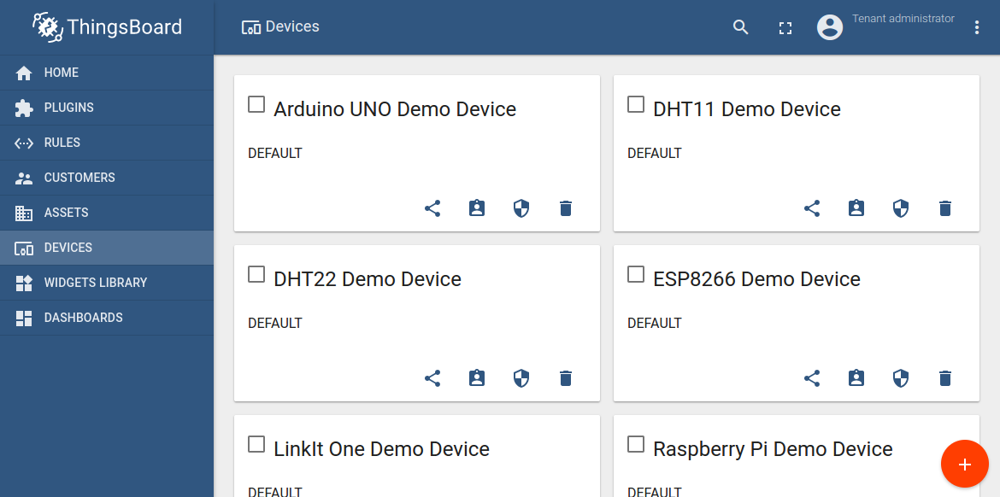
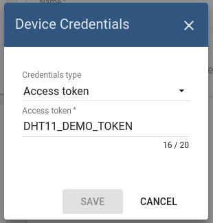
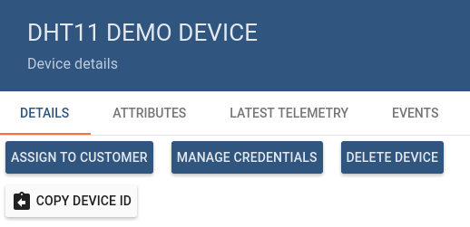
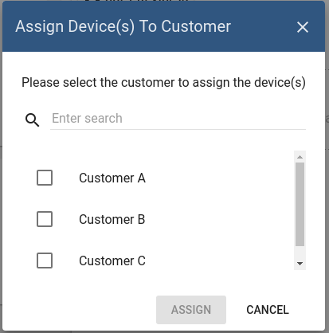
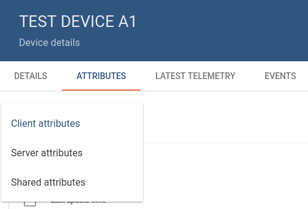
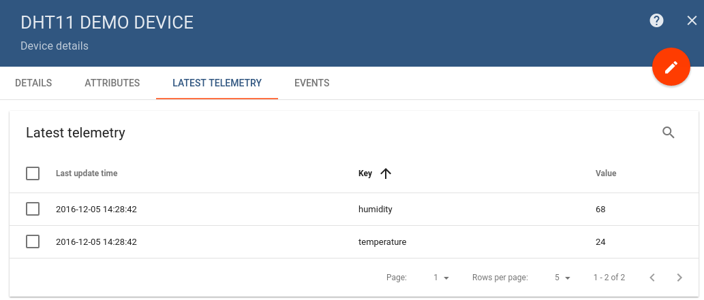
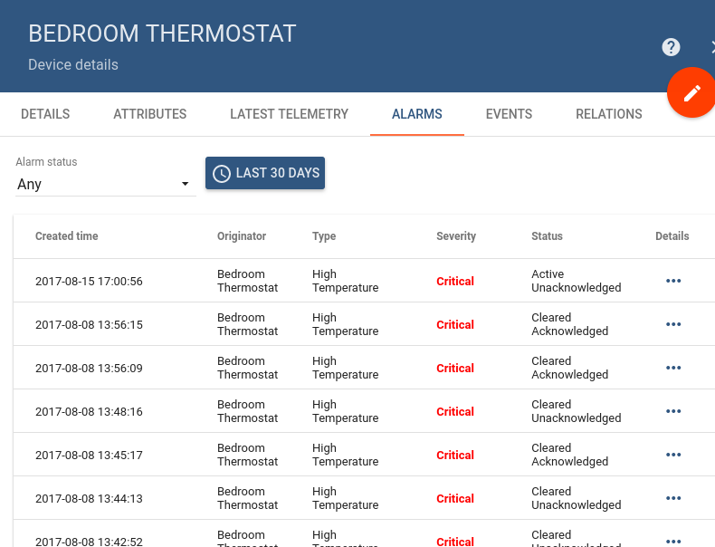
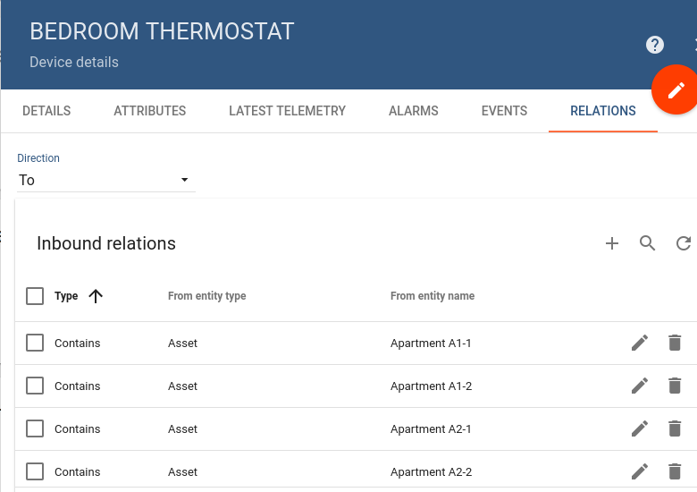

# devices

ThingsBoard support following device management features using Web UI and [REST API](https://github.com/caoyingde/thingsboard.github.io/tree/9437083b88083a9b2563248432cbbe460867fbaf/docs/reference/rest-api/README.md).

* TOC

  {:toc}

## Add and delete devices

Tenant administrator is able to register new devices or delete them from ThingsBoard.

## Manage device credentials

Tenant administrator is able to manage device credentials. Current release supports Access Token and X.509 Certificates based credentials.

## Get Device Id

Tenant administrator and customer users are able to copy device id to the clipboard using "Copy Device Id" button.

## Assign devices to customers

Tenant administrator is able to assign devices to certain [customer](https://github.com/caoyingde/thingsboard.github.io/tree/9437083b88083a9b2563248432cbbe460867fbaf/docs/user-guide/ui/customers/README.md). This will allow Customer users to fetch device data using REST APIs or Web UI.

## Browse device attributes

Tenant administrator and customer users are able to browse device [attributes](https://github.com/caoyingde/thingsboard.github.io/tree/9437083b88083a9b2563248432cbbe460867fbaf/docs/user-guide/attributes/README.md).

## Browse device telemetry

Tenant administrator and customer users are able to browse device [telemetry data](https://github.com/caoyingde/thingsboard.github.io/tree/9437083b88083a9b2563248432cbbe460867fbaf/docs/user-guide/telemetry/README.md).

## Browse device alarms

Tenant administrator and customer users are able to browse device [alarms](https://github.com/caoyingde/thingsboard.github.io/tree/9437083b88083a9b2563248432cbbe460867fbaf/docs/user-guide/alarms/README.md).

## Browse device events

Tenant administrator and customer users are able to browse events related to a particular device using "Events" tab. Lifecycle events and statistics are coming soon.

## Manage device relations

Tenant administrator and customer users are able to manage device [relations](https://github.com/caoyingde/thingsboard.github.io/tree/9437083b88083a9b2563248432cbbe460867fbaf/docs/user-guide/entities-and-relations/README.md).

