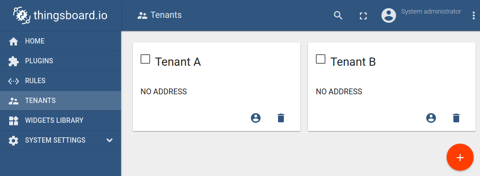
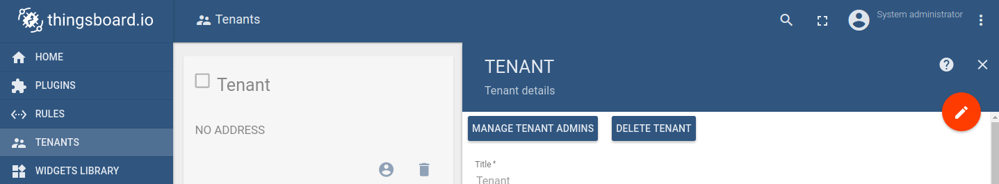

# tenants

* TOC

  {:toc}

ThingsBoard support [Multitenancy](https://en.wikipedia.org/wiki/Multitenancy) out-of-the-box. You can treat ThingsBoard tenant as a separate business-entity: individual or organization who owns or produce devices.

**System administrator** is able to create tenant entities.

System administrator is also able to create multiple [users](https://github.com/caoyingde/thingsboard.github.io/tree/9437083b88083a9b2563248432cbbe460867fbaf/docs/user-guide/ui/users/README.md) with **Tenant Administrator** role for each tenant by pressing "Manage Tenant Admins" button in Tenant details.

Tenant Administrator is able to do following actions:

* Provision and Manage [Devices](https://github.com/caoyingde/thingsboard.github.io/tree/9437083b88083a9b2563248432cbbe460867fbaf/docs/user-guide/ui/devices/README.md).
* Provision and Manage [Assets](https://github.com/caoyingde/thingsboard.github.io/tree/9437083b88083a9b2563248432cbbe460867fbaf/docs/user-guide/ui/assets/README.md).
* Create and Manage [Customers](https://github.com/caoyingde/thingsboard.github.io/tree/9437083b88083a9b2563248432cbbe460867fbaf/docs/user-guide/ui/customers/README.md).
* Create and Manage [Dashboards](https://github.com/caoyingde/thingsboard.github.io/tree/9437083b88083a9b2563248432cbbe460867fbaf/docs/user-guide/ui/dashboards/README.md).
* Configure [Rule Engine](https://github.com/caoyingde/thingsboard.github.io/tree/9437083b88083a9b2563248432cbbe460867fbaf/docs/user-guide/rule-engine-2-0/re-getting-started/README.md)
* Add or modify default widgets using [Widget Library](https://github.com/caoyingde/thingsboard.github.io/tree/9437083b88083a9b2563248432cbbe460867fbaf/docs/user-guide/ui/widget-library/README.md).

  All actions listed above are available using [REST API](https://github.com/caoyingde/thingsboard.github.io/tree/9437083b88083a9b2563248432cbbe460867fbaf/docs/reference/rest-api/README.md)

