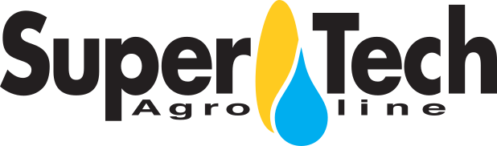

# agriculture

##  Supertech Agroline 

###  Develops, manufactures and sells high quality post-harvest equipment worldwide.

 ThingsBoard \(TB\) turned out to be a great match to build our Agricultural IoT platform. First and foremost because of the extremely skilled and service minded architects behind it. Together with the TB developers several new features were added to the platform for our needs, among these the Asset system and PostgreSQL support. These new features gave us the possibility to model our data structure using only TB as the backend, both on the multi-tenant cloud server and on-premise installations. The real time UI system proved useful both in development phase and for our final user interface.

 Using TB as our platform allowed us to rapidly achieve a very genetic solution that will serve our scaling needs for years to come. Jeppe Walther  
CTO

##  Enviroeye 

###  Developers of VineHub, the industry's first integrated vineyard management and automation platform.

 ThingsBoard \(TB\) has been an amazing discovery after much searching. The thought and architectural maturity of the platform is unmatched in the market. It’s allowed us to bring our platform to market a full 18 months sooner, than if we had embarked on developing our own backend and visualisation capabilities. With such a flexible UI, even with just a basic understanding of HTML and Javascript one can quickly and easily begin customising and designing they’re own widgets. This has provided great value to our growers since we can build them customised dashboards with very little time and effort on our part. The ability to ingest data directly from our LoRaWAN MQTT broker, via the platform’s IoT Gateway feature, has eliminated the need for us to maintain a seperate middleware layer, improving our operational efficiencies.

 All in all, Andrew and all the amazingly helpful guys at ThingsBoard, have developed a highly capable and scalable solution for just about any IoT application and we say look no further for your next IoT project. Mark Morris  
Founder & Managing Director

