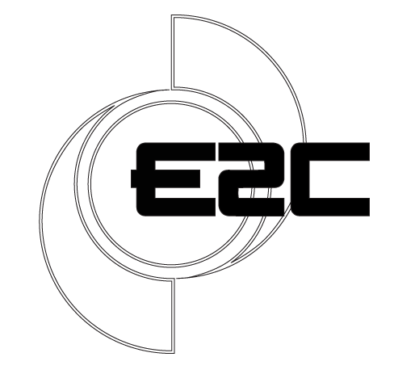
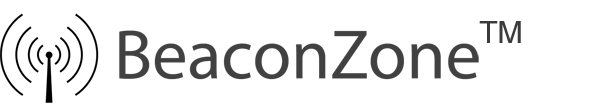

# smart-buildings

##  Sensolyze GmbH 

###  We are providing Digital Office Solutions for Workspace Managers and Office Planners that help them to better understand how their Spaces are used.

 When we started with ThingsBoard we mainly used it for core messaging and the dashboard functionality. Large parts of the business logic was done by an external backend connecting to ThingsBoard using the API. Within the first two releases of the new Rule Engine, we were able to migrate basically everything to the platform.

 I want to congratulate the team for the huge effort they have put into the solution. The concept of the rule engine and the available nodes are very well thought through and support a wide range of applications. And - probably most important - Andrew and his team listens closely to the needs and requirements of their customers. And you clearly see that in the product. We can commend this product to anybody looking for a flexible and stable IoT Solution and are looking forward to work with the team in the future.  Andreas Brandl  
 Founder & CEO

##  Environmental Energy Controls 

###  Environmental Energy Controls delivers turnkey "End-to-End" solutions relating to Building Energy Management Systems \(BEMS\)

 Our company operates with the Smart Building Technology sector and were looking for a solution that was adaptable, programmable and easy to use for providing complete solutions to our existing customers with good clear visualisations of their data. We had researched and tried other solutions but no other could match this platform in terms of its capability. Once learning the basics, we could quickly deploy and add customers sites without the need for continual support.

 What we especially like from the Thingsboard team are the updates and continual evolving development cycles, real people you can talk to and understand ideas, concepts and future use cases. Features to the system are being updated and new functionality added where, in the modern age of new technology, is essential to offer new services when they occur.

 The support levels received from initial contact to ongoing projects has been excellent from the entire team and we look forward to expanding our future solutions to all customers with the support from the Thingsboard team.

 If you haven’t tried this solution we 100% recommend it to anyone interested in emerging IOT platforms and what the value collected data can truly bring. Nairn Harrison  
 Director

##  BeaconZone 

###  Specialists in Bluetooth® Beacon Solutions

 ThingsBoard offers a secure, scalable IoT solution that, being Open Source, we can control. Having created our own ThingsBoard instance, we have found it to be very customisable via widgets, the rule engine and the plugin system allowing it to be used in a variety of specialist situations.  Simon Judge  
 Co-founder at BeaconZone

##  Conbee GmbH 

###  Optimization of logistics and production processes.

 As a number of IOT dashboard available, It is hard to find one which can fulfill all requirements, robust and scalable for the industrial use case.

 ThingsBoard is the platform which fulfilled our requirements and It is easy to adapt, flexible and have the ability to present data on different widgets in an attractive way with easy access. In addition, we are thankful to the ThingsBoard team for their tremendous service and we are looking forward to making more IOT solutions with ThingsBoard in future. MIchael Nickolai  
 Co-Founder & Executive Manager

##  Oneserve Limited 

### An award winning Field Service Management platform

 We operate in highly competitive markets; from housing management to utilities and manufacturing sectors. Technology innovation is at the heart of our product strategy and service delivery approach. As we grow and extend our field service management solution, we recognised that we needed a flexible IoT platform that enables our delivery needs with lower complexity and cost without sacrificing functionality and extensibility.

 The ThingsBoard platform has, within a short space of time, easily fulfilled our requirements. It is easy to adapt, has highly flexible implementation options and includes a broad suite of integration and visualization capabilities out of the box.

 The platform is continually being extended and improved, with the ThingsBoard Team both accessible and supportive to all of our needs. We now have a robust industrial platform that unlocks our IoT service goals.  Mark Hunt  
 CTO

