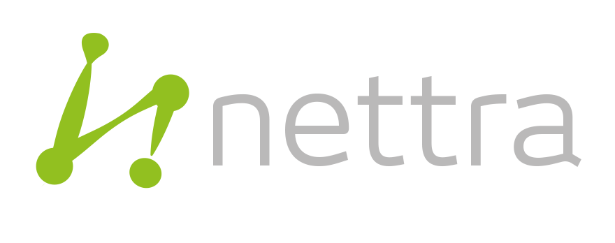

# smart-energy

##  Oneserve Limited 

### An award winning Field Service Management platform

 We operate in highly competitive markets; from housing management to utilities and manufacturing sectors. Technology innovation is at the heart of our product strategy and service delivery approach. As we grow and extend our field service management solution, we recognised that we needed a flexible IoT platform that enables our delivery needs with lower complexity and cost without sacrificing functionality and extensibility.

 The ThingsBoard platform has, within a short space of time, easily fulfilled our requirements. It is easy to adapt, has highly flexible implementation options and includes a broad suite of integration and visualization capabilities out of the box.

 The platform is continually being extended and improved, with the ThingsBoard Team both accessible and supportive to all of our needs. We now have a robust industrial platform that unlocks our IoT service goals.  Mark Hunt  
 CTO

##  Nettra 

### IOT Company specialized in the monitoring and control of distributed infrastructures

 We had been working on the development of our own software platform for almost 6 months when we came across Thingsboard. Not only Thingsboard had all the functionalities we had already developed, but also included many more that were on our pipeline for the coming months. Switching to Thingsboard was a no-brainer.

 The platform has proven to be very reliable, with great support and constant evolution. Definitely the right choice for our company. Agustin Derregibus  
 CEO & Co-Founder

##  Berliner Energieinstitut GmbH 

 We were struggling trying to implement our own IOT infrastructure when ThingsBoard suddenly appeared. Immediately we started testing and were amazed with the feature completeness, stability and ease of use of this great platform, although it was only in version 1.0 and had been released just days prior.

 Our business needed some special features on the frontend and some major modifications on the backend but after exchanging a few emails it was clear that ThingsBoard was the way to go. The necessary changes were implemented in a matter of a few weeks and the quality and thoroughness of the implementation far exceed our expectations. I've been working with OSS since the mid 1990s and know of it's many benefits but the quality of ThingsBoard as well as the speed of development continues to impress me.  David Eitzinger  
 Managing Director

##  Visible Energy, Inc. 

 The reason we have decided to use TB for our product line of IoT for commercial refrigeration CloudFridge is not just the technology but the people behind the technology. The TB team has proven competence, high ethical standards and dedication to their platform. We will definitely adopt TB for our future blockchain products as well. Marco Graziano  
 CEO & Founder

##  Environmental Energy Controls 

###  Environmental Energy Controls delivers turnkey "End-to-End" solutions relating to Building Energy Management Systems \(BEMS\)

 Our company operates with the Smart Building Technology sector and were looking for a solution that was adaptable, programmable and easy to use for providing complete solutions to our existing customers with good clear visualisations of their data. We had researched and tried other solutions but no other could match this platform in terms of its capability. Once learning the basics, we could quickly deploy and add customers sites without the need for continual support.

 What we especially like from the Thingsboard team are the updates and continual evolving development cycles, real people you can talk to and understand ideas, concepts and future use cases. Features to the system are being updated and new functionality added where, in the modern age of new technology, is essential to offer new services when they occur.

 The support levels received from initial contact to ongoing projects has been excellent from the entire team and we look forward to expanding our future solutions to all customers with the support from the Thingsboard team.

 If you haven’t tried this solution we 100% recommend it to anyone interested in emerging IOT platforms and what the value collected data can truly bring. Nairn Harrison  
 Director

