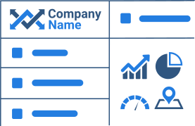
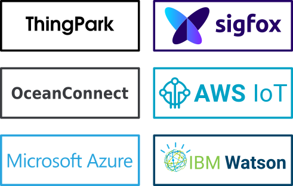
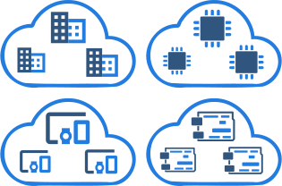
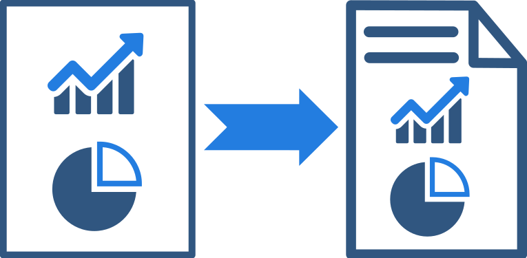
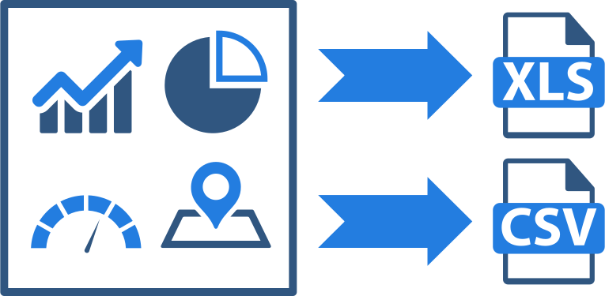

# index

## Advanced ThingsBoard IoT Platform distribution with value added features

### White-labeling

Rebrand ThingsBoard platform web interface with your company or product logo and color scheme in 2 minutes. No coding or service restart required. Allow your customers and their sub-customers to white-label their interface as well.  

[Read more](https://github.com/caoyingde/thingsboard.github.io/tree/9437083b88083a9b2563248432cbbe460867fbaf/docs/user-guide/white-labeling/README.md)

### Platform Integrations

Stream data from devices connected to existing IoT Platforms to enable real-time interactive dashboards and efficient data processing. Connect NB IoT, LoRaWAN and SigFox devices with specific payload formats using highly customizable data converters. Design and plugin your own converter as a JavaScript functions in real-time.  

[Read more](https://github.com/caoyingde/thingsboard.github.io/tree/9437083b88083a9b2563248432cbbe460867fbaf/docs/user-guide/integrations/README.md)

### Device & Asset Groups

Group your assets and devices to simplify administration tasks. Customize set of columns for each group and trigger actions on devices directly from administration interface.  

[Read more](https://github.com/caoyingde/thingsboard.github.io/tree/9437083b88083a9b2563248432cbbe460867fbaf/docs/user-guide/groups/README.md)

### Scheduler

Schedule various types of events including report generation, commands to devices and configuration updates with flexible schedule configuration.  

[Read more](https://github.com/caoyingde/thingsboard.github.io/tree/9437083b88083a9b2563248432cbbe460867fbaf/docs/user-guide/scheduler/README.md)

### Reporting

Generate great looking reports using dashboards visualization capabilities. Generate reports by schedule or export by demand.  

[Read more](https://github.com/caoyingde/thingsboard.github.io/tree/9437083b88083a9b2563248432cbbe460867fbaf/docs/user-guide/reporting/README.md)

### CSV/XLS data export

Export any dashboard widget data to CSV or XLS format. Allow your customers to download valuable insights from their device's data and review them in offline mode.  

[Read more](https://github.com/caoyingde/thingsboard.github.io/tree/9437083b88083a9b2563248432cbbe460867fbaf/docs/user-guide/csv-xls-data-export/README.md)

## Customers

## Feature Comparison Matrix

|  | ThingsBoard Community Edition |  | ThingsBoard Professional Edition |  |
| :--- | :--- | :--- | :--- | :--- |
|  |  |  |  |  |
| Asset management & Data collection |  |  |  |  |
| End-user real-time dashboards |  |  |  |  |
| Customizable rule chains, widgets |  |  |  |  |
| MQTT, HTTP, CoAP, OPC-UA transport |  |  |  |  |
| Integrations with BigData systems |  |  |  |  |
| NB-IoT, SigFox, LoRaWAN support | Basic |  | Advanced |  |
| [Rule Engine: Components](https://github.com/caoyingde/thingsboard.github.io/tree/9437083b88083a9b2563248432cbbe460867fbaf/docs/user-guide/rule-engine-2-0/architecture/README.md#message-queue) | Basic |  | Advanced |  |
| [Rule Engine: Persistent Message Queue](https://github.com/caoyingde/thingsboard.github.io/tree/9437083b88083a9b2563248432cbbe460867fbaf/docs/user-guide/rule-engine-2-0/overview/README.md) |  |  |  |  |
| [Device, assets and customer groups](https://github.com/caoyingde/thingsboard.github.io/tree/9437083b88083a9b2563248432cbbe460867fbaf/docs/user-guide/groups/README.md) |  |  |  |  |
| [Scheduler](https://github.com/caoyingde/thingsboard.github.io/tree/9437083b88083a9b2563248432cbbe460867fbaf/docs/user-guide/scheduler/README.md) |  |  |  |  |
| [Reporting](https://github.com/caoyingde/thingsboard.github.io/tree/9437083b88083a9b2563248432cbbe460867fbaf/docs/user-guide/reporting/README.md) |  |  |  |  |
| [Multi-tenant configurable white-labeling](https://github.com/caoyingde/thingsboard.github.io/tree/9437083b88083a9b2563248432cbbe460867fbaf/docs/user-guide/white-labeling/README.md) |  |  |  |  |
| [CSV/XLS data export](https://github.com/caoyingde/thingsboard.github.io/tree/9437083b88083a9b2563248432cbbe460867fbaf/docs/user-guide/csv-xls-data-export/README.md) |  |  |  |  |
| [Platform Integrations](https://github.com/caoyingde/thingsboard.github.io/tree/9437083b88083a9b2563248432cbbe460867fbaf/docs/user-guide/integrations/README.md) |  |  |  |  |

### Flexible deployment options

Deploy ThingsBoard platform in the cloud or on premises. Use commodity hardware to scale out horizontally by adding new nodes to your cluster. Single ThingsBoard server can support 10 000+ devices and 100M messages per hour, while simple cluster can support millions of devices and billions of messages.

### Simple and predictable pricing models

Say "No!" to per message or per device pricing that turns to a monster bills in production system. ThingsBoard PE supports two simple and predictable pricing models depending on your product life-cycle stage.  
  

### Pay as you go

#### Install ThingsBoard PE in two minutes on the AWS or Azure cloud and pay hourly rate per server only when you use the platform. Best suite for early evaluation phase or PoCs.

  

[Pay as you go](https://github.com/caoyingde/thingsboard.github.io/tree/9437083b88083a9b2563248432cbbe460867fbaf/products/thingsboard-pe/install/?deploy=cloud/README.md)

[Free trial](https://github.com/caoyingde/thingsboard.github.io/tree/9437083b88083a9b2563248432cbbe460867fbaf/products/thingsboard-pe/install/?deploy=trial/README.md)

### Pay yearly

#### Install ThingsBoard PE on any cloud or on premises and pay one-time license fee per server and optional software updates subscription for subsequent years of usage. Save up to 40% comparing to pay-as-you-go per hour rate on the license fee.

[Pay yearly](https://github.com/caoyingde/thingsboard.github.io/tree/9437083b88083a9b2563248432cbbe460867fbaf/products/thingsboard-pe/install/?deploy=premise/README.md)

[Free trial](https://github.com/caoyingde/thingsboard.github.io/tree/9437083b88083a9b2563248432cbbe460867fbaf/products/thingsboard-pe/install/?deploy=trial/README.md)

 [Try it now](https://github.com/caoyingde/thingsboard.github.io/tree/9437083b88083a9b2563248432cbbe460867fbaf/products/thingsboard-pe/install/?deploy=trial/README.md)

