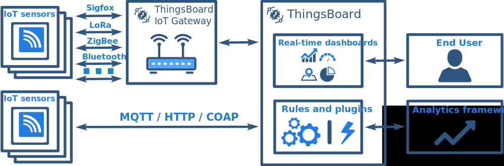

# smart-farming

## Overview

ThingsBoard platform provides out-of-the-box components and APIs to dramatically reduce time to market and your effort to develop smart farming solutions and projects. The platform is device-agnostic, so you can feed and analyze the data from any sensor, connected device or application. Save up to 90% of development time for your smart farming project by utilizing following benefits:

* Reliable and fault-tolerant data collection from your IoT devices and sensors to monitor facilities state, crop growth characteristics, humidity level, etc.;
* Advanced and flexible data visualization for real-time and historical monitoring of future farms;
* Customizable end-user dashboards to share farm monitoring results;
* Integration with third-party analytics frameworks and solutions for advanced analytics and machine learning;
* Optimize returns on inputs while preserving resources by remotely configuring IoT devices based on results of the analytics.

The platform provides production ready server infrastructure to connect your IoT devices, store and analyze collected IoT data, optimizing returns on inputs and resources.

## Smart farming dashboard

The following interactive dashboard hosted on live demo server represents smart farming IoT data visualization that may be embedded in your IoT agriculture project or future farm solution. See dashboard description below.

 [Live demo](https://demo.thingsboard.io/dashboards/1f9828d0-058e-11e7-87f7-bb0136cc33d0?publicId=963ab470-34c9-11e7-a7ce-bb0136cc33d0&source=realtimeIotDashboards)

The attached dashboard demonstrates real-time data from IoT sensors that is collected using ThingsBoard MQTT API. The data is stored in Cassandra DB on our demo server.

We would like to highlight following features:

* low-latency updates using web-sockets;
* ability to zoom-in into the charts by selecting time range with the mouse;
* advanced tooltips and legend;
* dashboard toolbar in the top-right corner enables global time selector and switch between dashboards.

## Smart farming solution overview

The diagram below identifies data flow and integration points for typical smart farming solution that uses ThingsBoard platform to collect and analyze smart farming data from IoT sensors.

You may notice that there are plenty of connectivity options for IoT sensors: either direct connection to the cloud or through the IoT Gateway. Platform supports industry standard encryption algorithms \(SSL\) and device credentials types \(X.509 certificates and access tokens\). The collected data is stored in Cassandra - fault-tolerant and reliable NoSQL database. ThingsBoard Rule Engine allows to forward incoming data to various analytics systems, such as Apache Spark or Hadoop using Kafka or other Message buses.

## Learn more

[Getting started](https://github.com/caoyingde/thingsboard.github.io/tree/9437083b88083a9b2563248432cbbe460867fbaf/docs/getting-started-guides/helloworld/README.md) [Customers feedback](https://github.com/caoyingde/thingsboard.github.io/tree/9437083b88083a9b2563248432cbbe460867fbaf/docs/feedback/README.md) [Platform features](https://github.com/caoyingde/thingsboard.github.io/tree/9437083b88083a9b2563248432cbbe460867fbaf/docs/README.md#platform-features) [Architecture](https://github.com/caoyingde/thingsboard.github.io/tree/9437083b88083a9b2563248432cbbe460867fbaf/docs/reference/architecture/README.md) [Contact us](https://github.com/caoyingde/thingsboard.github.io/tree/9437083b88083a9b2563248432cbbe460867fbaf/docs/contact-us/README.md)

